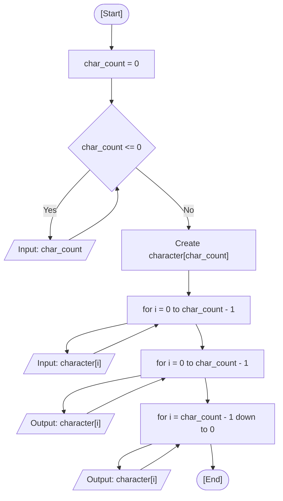

<div align="center">

  🇧🇷 **[Versão em Português](README.pt-BR.md)**
  <br>

  # ⚙️ Reverse Characters (`reverse_characters.c`)

</div>

---

## 🎯 Problem Statement

Read characters typed by the user and display them in reverse order. In my solution, I first ask how many characters will be typed (re-asking until the value is greater than 0), store them in an array whose size is decided at runtime, and then print the array twice: in the typed order and in the inverted order.

---

## 💻 Source Code

The implementation is available directly in [`reverse_characters.c`](reverse_characters.c).

---

## 📊 Algorithmic Flow & Trace



Trace for `char_count = 3` with the characters `x`, `y`, `z`:

| Step | Instruction | `char_count` | `i` | `character[0]` | `character[1]` | `character[2]` | Terminal Output |
| :---: | :--- | :---: | :---: | :---: | :---: | :---: | :--- |
| 1 | Declaration and initialization | `0` | `?` | `?` | `?` | `?` | - |
| 2 | Input `char_count` | `3` | `?` | `?` | `?` | `?` | Prompt user |
| 3 | `i = 0`: read | `3` | `0` | `x` | `?` | `?` | `Character 1:` |
| 4 | `i = 1`: read | `3` | `1` | `x` | `y` | `?` | `Character 2:` |
| 5 | `i = 2`: read | `3` | `2` | `x` | `y` | `z` | `Character 3:` |
| 6 | Print in order (`i = 0` to `2`) | `3` | `2` | `x` | `y` | `z` | `x y z` |
| 7 | Print inverted (`i = 2` down to `0`) | `3` | `0` | `x` | `y` | `z` | `z y x` |

---

## 🖥️ Terminal Output

```text
How many characters do you want to write? 0
How many characters do you want to write? 4

Character 1: a
Character 2: b
Character 3: c
Character 4: d

Characters in order: a b c d 
Characters in inverted order: d c b a 
```

---

## 💡 Key Concepts Applied

- **Array With Runtime Size:** `char character[char_count]` is a variable length array (C99), so its size is only known after the user answers the first question.
- **Index Starting at 0:** An array with `char_count` elements has valid positions from `0` to `char_count - 1`, which is why the loops stop with `i < char_count`.
- **Reverse Traversal:** The inverted output starts at the last index (`char_count - 1`) and decrements until `0` (`for (int i = char_count - 1; i >= 0; i--)`).
- **Input Buffer Hygiene:** The space before `%c` in `scanf(" %c", &character[i])` skips the Enter left in the buffer by the previous read.

---

## 🚀 How to Run

```bash
# Compile and run with GCC
mkdir -p dist && gcc -Wall -O2 src/08-reverse-characters/reverse_characters.c -o dist/reverse_characters && ./dist/reverse_characters

# Or compile and run with Clang (macOS default)
mkdir -p dist && clang -Wall -O2 src/08-reverse-characters/reverse_characters.c -o dist/reverse_characters && ./dist/reverse_characters
```
