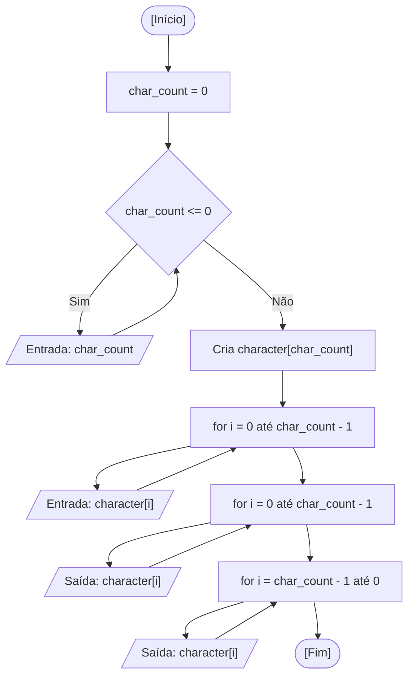

<div align="center">

  🇬🇧 **[English Version](README.md)**
  <br>

  # ⚙️ Caracteres em Ordem Reversa (`reverse_characters.c`)

</div>

---

## 🎯 Enunciado do Problema

Ler caracteres digitados pelo usuário e exibi-los em ordem reversa. Na minha solução, primeiro pergunto quantos caracteres serão digitados (perguntando de novo até o valor ser maior que 0), guardo todos em um array cujo tamanho é definido em tempo de execução e imprimo o array duas vezes: na ordem digitada e na ordem invertida.

---

## 💻 Código-Fonte

A implementação completa está disponível diretamente em [`reverse_characters.c`](reverse_characters.c).

---

## 📊 Fluxo e Teste de Mesa



Teste de mesa para `char_count = 3` com os caracteres `x`, `y`, `z`:

| Passo | Instrução | `char_count` | `i` | `character[0]` | `character[1]` | `character[2]` | Saída no Terminal |
| :---: | :--- | :---: | :---: | :---: | :---: | :---: | :--- |
| 1 | Declaração e inicialização | `0` | `?` | `?` | `?` | `?` | - |
| 2 | Entrada de `char_count` | `3` | `?` | `?` | `?` | `?` | Solicita ao usuário |
| 3 | `i = 0`: leitura | `3` | `0` | `x` | `?` | `?` | `Character 1:` |
| 4 | `i = 1`: leitura | `3` | `1` | `x` | `y` | `?` | `Character 2:` |
| 5 | `i = 2`: leitura | `3` | `2` | `x` | `y` | `z` | `Character 3:` |
| 6 | Impressão em ordem (`i = 0` até `2`) | `3` | `2` | `x` | `y` | `z` | `x y z` |
| 7 | Impressão invertida (`i = 2` até `0`) | `3` | `0` | `x` | `y` | `z` | `z y x` |

---

## 🖥️ Saída no Terminal

```text
How many characters do you want to write? 0
How many characters do you want to write? 4

Character 1: a
Character 2: b
Character 3: c
Character 4: d

Characters in order: a b c d 
Characters in inverted order: d c b a 
```

---

## 💡 Principais Conceitos Aplicados

- **Array com Tamanho em Tempo de Execução:** `char character[char_count]` é um array de tamanho variável (C99), então o tamanho só é conhecido depois que o usuário responde a primeira pergunta.
- **Índice Começando em 0:** Um array com `char_count` elementos tem posições válidas de `0` até `char_count - 1`, por isso as repetições terminam com `i < char_count`.
- **Percurso Reverso:** A saída invertida começa no último índice (`char_count - 1`) e decrementa até `0` (`for (int i = char_count - 1; i >= 0; i--)`).
- **Higiene do Buffer de Entrada:** O espaço antes do `%c` em `scanf(" %c", &character[i])` descarta o Enter que sobrou no buffer da leitura anterior.

---

## 🚀 Como Executar

```bash
# Compilar e executar com GCC
mkdir -p dist && gcc -Wall -O2 src/08-reverse-characters/reverse_characters.c -o dist/reverse_characters && ./dist/reverse_characters

# Ou compilar e executar com Clang (padrão macOS)
mkdir -p dist && clang -Wall -O2 src/08-reverse-characters/reverse_characters.c -o dist/reverse_characters && ./dist/reverse_characters
```
