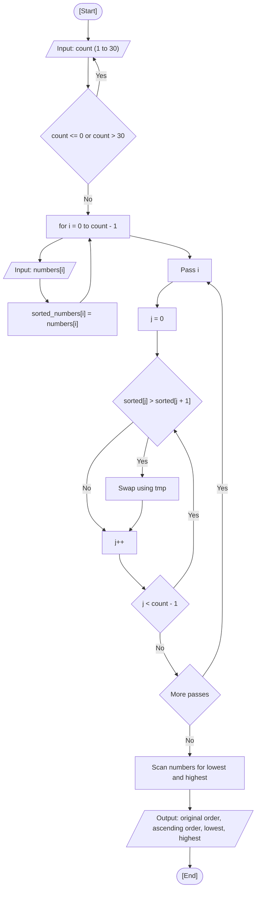

<div align="center">

  🇧🇷 **[Versão em Português](README.pt-BR.md)**
  <br>

  # ⚙️ Lowest and Highest Numbers (`lowest_highest_numbers.c`)

</div>

---

## 🎯 Problem Statement

Read up to 30 integers from the user, show the lowest and the highest values, and print all of them. This was the take-home task of the class. In my solution, I also tried to implement the bubble sort I had learned in CS50x: I copy the values into a second array, sort only the copy in ascending order, and keep the original array intact so I can print both orders.

---

## 💻 Source Code

The implementation is available directly in [`lowest_highest_numbers.c`](lowest_highest_numbers.c).

---

## 📊 Algorithmic Flow & Trace



Trace for `count = 3` with the values `5`, `2`, `9` (one bubble sort pass shown at a time):

| Step | Instruction | `numbers` | `sorted_numbers` | `lowest_number` | `highest_number` | Terminal Output |
| :---: | :--- | :---: | :---: | :---: | :---: | :--- |
| 1 | Declaration and initialization | `?, ?, ?` | `?, ?, ?` | `0` | `0` | - |
| 2 | Read and copy the three values | `5, 2, 9` | `5, 2, 9` | `0` | `0` | `Number 1` to `Number 3` |
| 3 | Pass 1, `j = 0`: `5 > 2` -> swap | `5, 2, 9` | `2, 5, 9` | `0` | `0` | - |
| 4 | Pass 1, `j = 1`: `5 > 9` -> no swap | `5, 2, 9` | `2, 5, 9` | `0` | `0` | - |
| 5 | Passes 2 and 3 (no more swaps) | `5, 2, 9` | `2, 5, 9` | `0` | `0` | - |
| 6 | Start scan with `numbers[0]` | `5, 2, 9` | `2, 5, 9` | `5` | `5` | - |
| 7 | `i = 1`: `2 < 5` -> lowest | `5, 2, 9` | `2, 5, 9` | `2` | `5` | - |
| 8 | `i = 2`: `9 > 5` -> highest | `5, 2, 9` | `2, 5, 9` | `2` | `9` | - |
| 9 | Display results | `5, 2, 9` | `2, 5, 9` | `2` | `9` | `Lowest number: 2. Highest number: 9.` |

---

## 🖥️ Terminal Output

```text
How many integer values do you want to store?
(You can only store up to 30 values.)
Answer: 0
How many integer values do you want to store?
(You can only store up to 30 values.)
Answer: 5

Enter the integer values below:
Number 1: 12
Number 2: -3
Number 3: 7
Number 4: 7
Number 5: 40

Numbers in original order:
12 - -3 - 7 - 7 - 40
Numbers in ascending order:
-3 - 7 - 7 - 12 - 40

Lowest number: -3. Highest number: 40.
```

---

## 💡 Key Concepts Applied

- **Arrays With Runtime Size:** `numbers[count]` and `sorted_numbers[count]` are variable length arrays (C99), bounded by the validation `count <= 30` to avoid exhausting the stack.
- **Bubble Sort on a Copy:** Each pass compares neighbor pairs and swaps them when they are out of order, so the highest value "bubbles" to the end. Sorting `sorted_numbers` keeps `numbers` in the typed order.
- **Lowest and Highest Scan:** A single pass starting with `numbers[0]` as both candidates. It is redundant after sorting (they would be `sorted_numbers[0]` and `sorted_numbers[count - 1]`), and I kept it on purpose just to practice.
- **Possible Improvement:** The inner loop could stop at `count - 1 - i`, since the last `i` positions are already fixed. The cost remains $O(n^2)$.

---

## 🚀 How to Run

```bash
# Compile and run with GCC
mkdir -p dist && gcc -Wall -O2 src/09-lowest-highest-numbers/lowest_highest_numbers.c -o dist/lowest_highest_numbers && ./dist/lowest_highest_numbers

# Or compile and run with Clang (macOS default)
mkdir -p dist && clang -Wall -O2 src/09-lowest-highest-numbers/lowest_highest_numbers.c -o dist/lowest_highest_numbers && ./dist/lowest_highest_numbers
```
