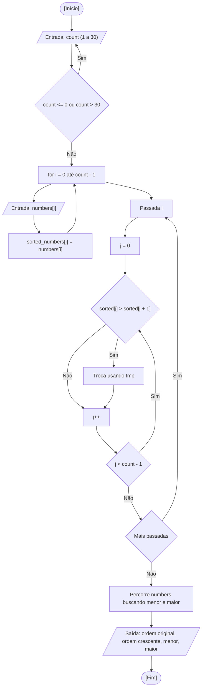

<div align="center">

  🇬🇧 **[English Version](README.md)**
  <br>

  # ⚙️ Maior e Menor Número (`lowest_highest_numbers.c`)

</div>

---

## 🎯 Enunciado do Problema

Ler até 30 números inteiros digitados pelo usuário, mostrar o menor e o maior valor e imprimir todos eles. Essa foi a tarefa de casa da aula. Na minha solução, também tentei implementar o bubble sort que aprendi no CS50x: copio os valores para um segundo array, ordeno só a cópia em ordem crescente e mantenho o array original intacto para imprimir as duas ordens.

---

## 💻 Código-Fonte

A implementação completa está disponível diretamente em [`lowest_highest_numbers.c`](lowest_highest_numbers.c).

---

## 📊 Fluxo e Teste de Mesa



Teste de mesa para `count = 3` com os valores `5`, `2`, `9`:

| Passo | Instrução | `numbers` | `sorted_numbers` | `lowest_number` | `highest_number` | Saída no Terminal |
| :---: | :--- | :---: | :---: | :---: | :---: | :--- |
| 1 | Declaração e inicialização | `?, ?, ?` | `?, ?, ?` | `0` | `0` | - |
| 2 | Leitura e cópia dos três valores | `5, 2, 9` | `5, 2, 9` | `0` | `0` | `Number 1` a `Number 3` |
| 3 | Passada 1, `j = 0`: `5 > 2` -> troca | `5, 2, 9` | `2, 5, 9` | `0` | `0` | - |
| 4 | Passada 1, `j = 1`: `5 > 9` -> sem troca | `5, 2, 9` | `2, 5, 9` | `0` | `0` | - |
| 5 | Passadas 2 e 3 (sem mais trocas) | `5, 2, 9` | `2, 5, 9` | `0` | `0` | - |
| 6 | Início da busca com `numbers[0]` | `5, 2, 9` | `2, 5, 9` | `5` | `5` | - |
| 7 | `i = 1`: `2 < 5` -> menor | `5, 2, 9` | `2, 5, 9` | `2` | `5` | - |
| 8 | `i = 2`: `9 > 5` -> maior | `5, 2, 9` | `2, 5, 9` | `2` | `9` | - |
| 9 | Exibe os resultados | `5, 2, 9` | `2, 5, 9` | `2` | `9` | `Lowest number: 2. Highest number: 9.` |

---

## 🖥️ Saída no Terminal

```text
How many integer values do you want to store?
(You can only store up to 30 values.)
Answer: 0
How many integer values do you want to store?
(You can only store up to 30 values.)
Answer: 5

Enter the integer values below:
Number 1: 12
Number 2: -3
Number 3: 7
Number 4: 7
Number 5: 40

Numbers in original order:
12 - -3 - 7 - 7 - 40
Numbers in ascending order:
-3 - 7 - 7 - 12 - 40

Lowest number: -3. Highest number: 40.
```

---

## 💡 Principais Conceitos Aplicados

- **Arrays com Tamanho em Tempo de Execução:** `numbers[count]` e `sorted_numbers[count]` são arrays de tamanho variável (C99), limitados pela validação `count <= 30` para não estourar a pilha.
- **Bubble Sort em uma Cópia:** Cada passada compara pares vizinhos e troca quando estão fora de ordem, então o maior valor "borbulha" até o fim. Ordenar `sorted_numbers` mantém `numbers` na ordem digitada.
- **Busca do Menor e do Maior:** Uma única passada começando com `numbers[0]` como os dois candidatos. É redundante depois da ordenação (seriam `sorted_numbers[0]` e `sorted_numbers[count - 1]`), e mantive de propósito só para praticar.
- **Melhoria Possível:** A repetição interna poderia parar em `count - 1 - i`, já que as últimas `i` posições já estão fixas. O custo continua $O(n^2)$.

---

## 🚀 Como Executar

```bash
# Compilar e executar com GCC
mkdir -p dist && gcc -Wall -O2 src/09-lowest-highest-numbers/lowest_highest_numbers.c -o dist/lowest_highest_numbers && ./dist/lowest_highest_numbers

# Ou compilar e executar com Clang (padrão macOS)
mkdir -p dist && clang -Wall -O2 src/09-lowest-highest-numbers/lowest_highest_numbers.c -o dist/lowest_highest_numbers && ./dist/lowest_highest_numbers
```
